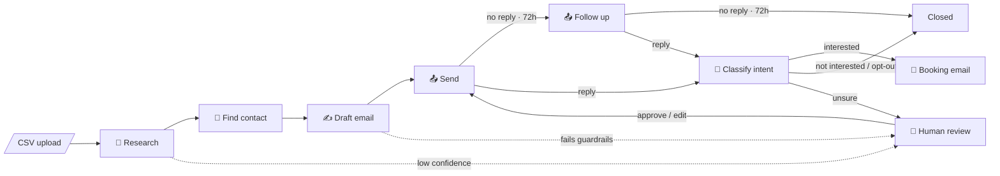
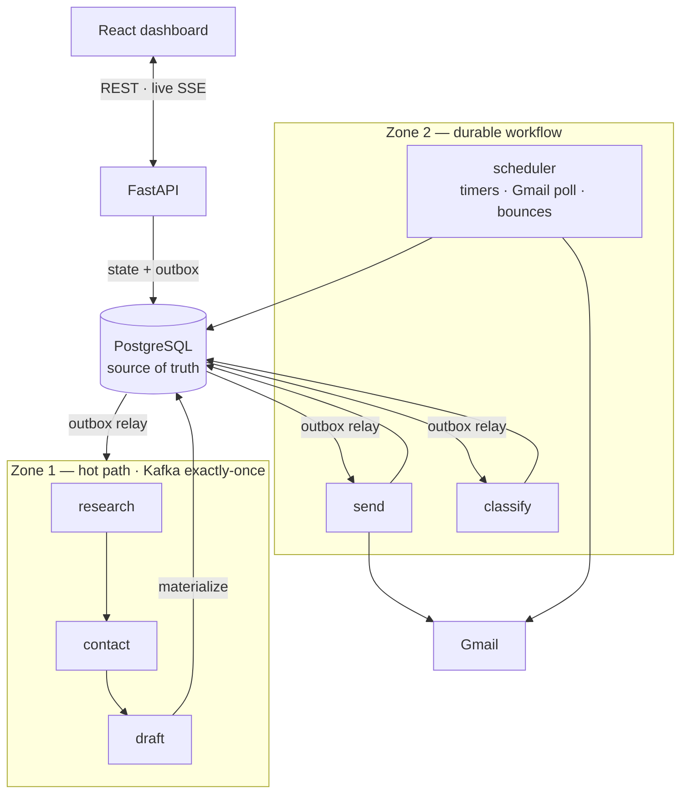
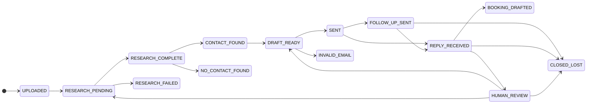

<div align="center">

# Agentic SDR

**An AI sales development rep that researches prospects, writes personalized cold emails, follows up, reads replies, and books meetings — and knows exactly when to hand off to a human.**


</div>

---

## Overview

Upload a CSV of target companies. For each one, a pipeline of five specialized agents:

1. **Researches** the company — website, recent news, pain points
2. **Finds** a verified decision-maker
3. **Writes** a personalized cold email grounded in that research and in what *you* sell
4. **Sends** it through Gmail and follows up after 72 hours
5. **Reads** the reply, classifies intent, and drafts a meeting-booking email when the prospect is interested

A live dashboard shows every lead moving through the pipeline, with a review queue for anything the system isn't confident about.

### What makes it different

Automating outreach naively causes real harm: duplicate emails, ignored unsubscribes, confident hallucinations about a prospect. This system treats those as **engineering constraints, not prompt instructions**:

| | |
|---|---|
| 🛑 **Compliance is code, not AI** | Opt-outs are caught by deterministic rules *before* any model sees the reply, and suppressed permanently. |
| 🔒 **Illegal states are impossible** | Every status change is a compare-and-set in Postgres. Races between workers, retries, and humans are resolved by the database. |
| ✉️ **No double-sends** | A claim lease guards every Gmail send, because Gmail has no idempotency keys. |
| 🙋 **Humans where it matters** | Low confidence, sensitive topics, or *"are you a bot?"* → human review queue, with the reason attached. |
| 📊 **Every action is accounted for** | Each agent call logs prompt version, model, tokens, latency, and confidence. Cost on the dashboard is real, not estimated. |

---

## How it works



| Agent | Job | Powered by |
|---|---|---|
| **Research** | Scrape the site + search news → summary, industry, size, pain points, confidence score | Firecrawl · Serper · LLM |
| **Contact** | Find a decision-maker; only *verified* emails are accepted | Hunter · Apollo |
| **Draft** | Write a short, specific email using the research and the seller profile | LLM |
| **Send** | Run compliance gates, send via Gmail, schedule the follow-up | Gmail API |
| **Classify** | Strip quoted history, apply rule-based checks, classify intent, draft a booking reply | LLM |

The LLM is swappable: **Claude** or **Gemini** via a single config flag.

---

## Architecture



### Two zones: *data streams while it moves, and persists when it stops*

The pipeline does two very different kinds of work, so it uses two consistency models.

**Zone 1: research → contact → draft.** Fast, back-to-back AI work. Each Kafka message *carries* the lead's data forward, and every worker consumes, works, and produces inside a **Kafka exactly-once transaction**. The database isn't touched until the lead stops moving.

**Zone 2: send → wait → reply → review.** Slow, stateful work: waiting 72 hours, sending real email, humans editing drafts. Here **Postgres is the source of truth**, because Kafka can't hold a lead for three days and Gmail can't undo a send.

When a lead finishes drafting (or fails, or needs review), it **materializes** from the stream into Postgres in a single guarded write.

### Key engineering decisions

| Decision | Why it matters |
|---|---|
| **Compare-and-set state machine**<br/>`UPDATE … WHERE status = <expected>` | A stale worker, duplicate message, or concurrent human click matches zero rows and backs off. Correctness doesn't depend on timing. |
| **Transactional outbox** | A state change and its outgoing message commit together, so the database and Kafka never disagree. |
| **Idempotent consumers** | Kafka delivers at-least-once; each handler records the event ID in the same transaction as its effects, so redeliveries are skipped. |
| **Claim lease before every send** | Stops two workers from emailing the same person. A crashed worker's claim expires on its own. |
| **Timers are a column** (`next_action_at`) | Follow-ups are an indexed timestamp polled with `SKIP LOCKED`. No sleeping processes, restart-safe, and visible in one SQL query. |
| **Partitioned by `lead_id`** | Each lead is processed in order; different leads run in parallel. The autoscaler's max matches the partition count. |
| **Dead-letter queue** | A malformed message is parked in `sdr.dlq` instead of blocking its partition. Infrastructure outages retry rather than skip. |
| **Leader election via Postgres advisory lock** | One scheduler at a time, with no extra infrastructure. |

Deep dive — topics, delivery semantics, failure matrix, Kubernetes topology: **[ARCHITECTURE.md](agentic-sdr/ARCHITECTURE.md)**

### Lead lifecycle



Defined once in [`transitions.py`](agentic-sdr/backend/app/transitions.py), unit-tested, and backed by a `CHECK` constraint in the database.

---

## Guardrails

**Before any model sees a reply**
- Opt-out language (*STOP*, *unsubscribe*, …) → permanent suppression + closed
- *"Are you an AI?"* or sensitive keywords → human review
- Quoted email history stripped, so only the prospect's new words are judged

**Before every send**
- Address validation
- Suppression list (opt-outs and hard bounces)
- 7-day resend window per address, across all leads
- Duplicate companies in a batch rejected at upload

**On every draft** — checked in code: under 200 words, includes an opt-out line, uses a concrete personalization fact, no pricing. A failing draft is retried once with the reason fed back to the model, then sent to human review.

**Confidence thresholds**

| Signal | Rule |
|---|---|
| Research | ≥ 0.65 to proceed · capped at 0.60 if no pain points were found |
| Interested reply | ≥ 0.80 to auto-draft a booking email |
| Not interested | ≥ 0.85 to auto-close |
| Everything else | Human review |

Booking emails are drafted automatically but **only sent when a human clicks send**.

---

## Dashboard

- **Live pipeline** — every lead's status updates in real time via Server-Sent Events
- **Review queue** — approve, edit, close, or retry, with the reason each lead was flagged
- **Lead detail** — research, contact, draft, reply, and the full agent history
- **Metrics** — throughput, outcomes, and real LLM spend from logged tokens
- **Seller profile** — what you sell, to whom, and in what tone; required before any upload so every email is grounded in a real offer

---

## Observability

- **Agent logs** — every action records prompt version, model, input/output tokens, latency, confidence, and before/after status
- **Versioned prompts** — every output traces back to the exact prompt that produced it
- **Prometheus metrics** — per-stage throughput, latency histograms, token counters, DLQ rate
- **Structured JSON logs** — `lead_id` and `trace_id` on every line; one search follows a lead across all services
- **Health probes** — `/healthz` and `/readyz` on the API, heartbeat checks on workers

---

## Getting started

**Requirements:** Docker Desktop

```bash
cd agentic-sdr
cp .env.example .env            # add your API keys
cd deploy
docker compose --env-file ../.env up --build -d
```

Open **http://localhost:5173**, then:

1. Fill in the **Profile** tab
2. Upload a CSV with a `company_name` column (optional: `website`, `contact_email`, `contact_name`, `contact_role`); see [`demo_leads.csv`](agentic-sdr/demo_leads.csv)
3. Watch leads move through the pipeline and handle anything in the review queue

| Setting | Options |
|---|---|
| `APP_PROFILE` | `dev` runs without API keys (leads park with a clear error) · `prod` refuses to boot if any key is missing |
| `LLM_PROVIDER` | `anthropic` (Claude) · `gemini` (Gemini 2.5 Flash) |

**Gmail setup:** add `GMAIL_CLIENT_ID` and `GMAIL_CLIENT_SECRET` to `.env`, call `POST /api/gmail/auth`, open the returned link, and paste the `refresh_token` from the callback into `.env`.

<details>
<summary><b>Deploy to Kubernetes (kind)</b></summary>

```bash
cd agentic-sdr
kind create cluster --name sdr
docker build -t agentic-sdr-backend:local  backend
docker build -t agentic-sdr-frontend:local frontend
kind load docker-image agentic-sdr-backend:local agentic-sdr-frontend:local --name sdr

cd deploy/k8s
cp 01-secret.example.yaml 01-secret.yaml     # fill in values
kubectl apply -f 00-namespace.yaml -f 01-secret.yaml -f 02-configmap.yaml
kubectl apply -f 10-postgres.yaml -f 11-kafka.yaml
kubectl -n agentic-sdr wait --for=condition=ready pod -l app=kafka --timeout=180s
kubectl apply -f 12-kafka-topics-job.yaml
kubectl apply -f 20-api.yaml -f 21-workers.yaml -f 22-scheduler.yaml -f 23-frontend.yaml -f 31-hpa-research.yaml
kubectl -n agentic-sdr port-forward svc/frontend 5173:80
```

One backend image runs every role. Each worker scales independently, and the research stage has a Horizontal Pod Autoscaler.

</details>

### Tests

```bash
cd agentic-sdr/backend
python -m unittest discover tests -v
```

42 unit tests cover the state machine, zone boundaries, compliance rules, event contracts, LLM output parsing, and reply quote-stripping. None need running infrastructure.

---

## Project structure

```
agentic-sdr/
├── backend/
│   ├── app/
│   │   ├── api/            FastAPI: REST, live events, seller profile, Gmail OAuth
│   │   ├── workers/        shared consumer runtime (one image, five stages)
│   │   ├── stages/         research · contact · draft · send · classify
│   │   ├── integrations/   Firecrawl, Serper, Hunter, Apollo, Gmail
│   │   ├── scheduler.py    outbox relay, follow-up timers, Gmail polling, bounce scan
│   │   ├── transitions.py  the state machine
│   │   ├── repository.py   all SQL in one place
│   │   ├── llm.py          provider wrapper: retries, timeouts, rate pacing, token capture
│   │   └── prompts.py      versioned prompts
│   ├── migrations/         forward-only SQL
│   └── tests/
├── frontend/               React + Vite + Tailwind dashboard
├── deploy/
│   ├── docker-compose.yml
│   └── k8s/                Kafka, Postgres, API, workers, scheduler, autoscaler, ingress
└── ARCHITECTURE.md
```
