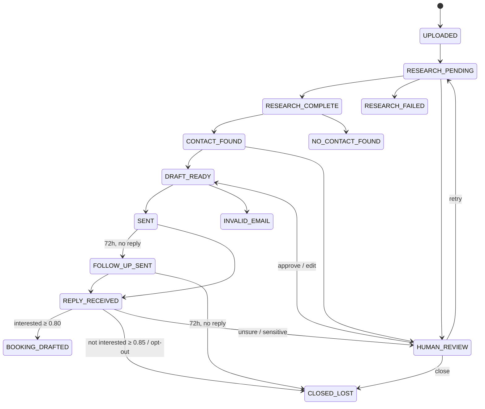

# Agentic SDR

**An autonomous sales development rep that researches companies, finds the right person, writes a personalized cold email, sends it, follows up, reads the reply, and drafts the meeting invite — and knows when to stop and ask a human.**

Built as an event-driven, multi-agent system on Kafka + PostgreSQL, deployable to Kubernetes.

**Stack:** Python · FastAPI · Apache Kafka (KRaft, exactly-once transactions) · PostgreSQL · React + Vite + Tailwind · Docker · Kubernetes · Claude / Gemini · Firecrawl · Serper · Hunter · Apollo · Gmail API

---

## The problem

An SDR spends most of the day on work that is repetitive but can't be done carelessly: reading a prospect's website, finding a decision-maker, writing an email that doesn't read like a template, remembering to follow up, and triaging replies. Automating it naively creates real damage — emails sent twice, opt-outs ignored, confident hallucinations about a prospect's business.

This project automates the whole loop while treating **correctness and compliance as hard constraints, not prompt instructions**:

- An AI never decides whether an unsubscribe request is honored — a regex does, before any model sees the reply.
- A lead can never be in two states at once, or skip a state — the database rejects it.
- Anything the system is unsure about goes to a human review queue with the reason attached.

## What it does

```
CSV of companies ─▶ Research ─▶ Find contact ─▶ Draft email ─▶ Send ─▶ wait 72h ─▶ Follow up ─▶ wait 72h ─▶ close
                                                                  │                   │
                                                                  └──── reply ────────┴─▶ Classify intent
                                                                                             ├─ interested     ─▶ draft booking email
                                                                                             ├─ not interested ─▶ close
                                                                                             ├─ opt-out        ─▶ suppress forever
                                                                                             └─ unsure         ─▶ human review
```

| Stage | What happens | Tools |
|---|---|---|
| **Research** | Scrapes the company site and recent news, extracts summary, industry, size, pain points, and a confidence score | Firecrawl, Serper, LLM |
| **Contact** | Finds a decision-maker; Hunter results are only accepted if the email is *verified*. Skipped if the CSV already names a contact | Hunter, Apollo |
| **Draft** | Writes a personalized email using the research + the seller's own profile (what they sell, to whom, in what tone) | LLM |
| **Send** | Runs compliance gates, sends via Gmail, schedules the follow-up | Gmail API |
| **Classify** | Strips quoted history from the reply, runs deterministic checks, then classifies intent and drafts a booking email if interested | LLM |

Before any upload, the operator fills in a **seller profile** (product, value proposition, target customer, sender, meeting link). The pipeline refuses to run without it — personalized outreach from a system that doesn't know what it's selling is fiction.

The **React dashboard** shows every lead moving through the pipeline live (Server-Sent Events), a human review queue with approve / edit / close / retry actions, per-lead agent history, and the real LLM spend computed from logged token usage.

---

## Architecture

```mermaid
flowchart LR
    UI[React dashboard] -- REST / SSE --> API[FastAPI]
    API -- outbox --> PG[(PostgreSQL<br/>source of truth)]

    subgraph Z1[Zone 1 · hot path · Kafka exactly-once]
        RW[research worker] --> CW[contact worker] --> DW[draft worker]
    end

    subgraph Z2[Zone 2 · durable workflow]
        SW[send worker]
        CLW[classify worker]
        SCH[scheduler<br/>timers · Gmail poll · bounces · reaper]
    end

    PG -- sdr.cmd.research --> RW
    DW -- materialize --> PG
    PG -- sdr.cmd.send --> SW
    SW --> GM[Gmail]
    SCH -- polls replies --> GM
    PG -- sdr.cmd.classify --> CLW
    SW --> PG
    CLW --> PG
    SCH --> PG
    Z1 -. sdr.evt.leads .-> API
    Z2 -. sdr.evt.leads .-> API
```

### Two zones: *data streams while it moves, and persists when it stops*

The pipeline has two very different kinds of work, so it uses two consistency models.

**Zone 1 — the hot path (research → contact → draft).** Each Kafka message *carries* the lead's accumulated data (seed → +research → +contact). Workers consume, do their work, and produce the next command using **Kafka exactly-once transactions** — the consumer offset and the output message commit atomically. Postgres is not touched on the happy path. This is the one place where exactly-once is genuinely achievable (Kafka-to-Kafka), so the design uses it there.

**The boundary.** When a lead stops moving — draft ready, research failed, no contact, low confidence — it **materializes** into Postgres in a single guarded write.

**Zone 2 — the durable workflow (send → wait 72h → reply → review).** Postgres is the source of truth. This zone exists because Kafka can't hold a lead for 72 hours, humans need random-access edits, Gmail has no idempotency keys, and compliance data must be queryable.

### Key design decisions (and why)

| Decision | Why |
|---|---|
| **Enforced state machine** — every status change is `UPDATE … WHERE id = ? AND status = <expected>` | A stale worker, a duplicate message, or a human clicking at the same moment matches zero rows and loses cleanly. Race conditions are resolved by the database, not by hoping processes behave. Backed by a `CHECK` constraint on the status column. |
| **Transactional outbox** | A state change and the message announcing it commit in one Postgres transaction; a relay publishes to Kafka afterwards. Solves the dual-write problem — the DB and the broker can lag, but never disagree. |
| **Idempotent consumers** (`processed_events` table) | Kafka delivers at-least-once. Each handler records the event ID in the same transaction as its effects, so a redelivered message is detected and skipped. |
| **Claim lease before sending** | Gmail can't dedupe sends. The send worker claims the lead (CAS with expiry) before calling Gmail, so two workers can't both send; a crashed worker's claim expires and self-heals. |
| **Time is a column** (`next_action_at`) | All follow-ups and expiries are driven by one indexed timestamp polled with `FOR UPDATE SKIP LOCKED`. No sleeping processes, no cron drift, restart-safe, and pending timers are a single SQL query. |
| **Keyed by `lead_id`, 6 partitions** | Messages for one lead are processed in order; different leads run in parallel. Partition count is the parallelism ceiling, so the research autoscaler maxes at 6. |
| **Scheduler leadership via Postgres advisory lock** | Leader election with zero new infrastructure. |
| **Dead-letter queue** | A malformed message goes to `sdr.dlq` with stage + error headers; the partition keeps flowing. Infra outages (DB/broker down) instead seek back and retry — delayed, never skipped. |

Full detail, including the failure matrix and delivery-semantics discussion: **[ARCHITECTURE.md](ARCHITECTURE.md)**.

### Lead lifecycle



The transition matrix lives in [`backend/app/transitions.py`](backend/app/transitions.py) and is unit-tested.

---

## Guardrails

The rules that matter most are deterministic code, and they run **before** any model is consulted.

**On every reply**
- Opt-out language (STOP, unsubscribe, …) → permanent suppression list + `CLOSED_LOST`. CAN-SPAM compliance never depends on a confidence score.
- "Are you an AI?" or sensitive keywords → `HUMAN_REVIEW`.
- Quoted email history is stripped first, so the classifier judges what the prospect actually wrote.

**Before every send**
1. Email address validation
2. Suppression list check (opt-outs and hard bounces)
3. 7-day resend window per address, across all leads
4. Duplicate companies in a batch rejected at ingest (partial unique index)

**On every draft** — checked in code: under 200 words, contains an opt-out line, uses one concrete personalization fact, no pricing. A failing draft is retried once *with the rejection reason fed back to the model*, then sent to human review.

**Confidence thresholds**

| Signal | Rule |
|---|---|
| Research confidence | must be ≥ 0.65 to proceed; capped at 0.60 if no pain points were found (hallucination guard) |
| Interested reply | auto-drafts a booking email only at ≥ 0.80 |
| Not-interested reply | auto-closes only at ≥ 0.85 |
| Anything else | human review |

Booking emails are drafted automatically but **sent only when a human clicks send**.

---

## Observability

- **Every agent action is logged** to `agent_logs` with prompt version, model, input/output tokens, latency, confidence, and before/after status. A lead's full history can be reconstructed from the logs alone.
- **Real cost**, not an estimate — the dashboard multiplies logged tokens by the model's price table.
- **Versioned prompts** (`research-v4`, `email-writer-v3`, `reply-classifier-v2`, `booking-draft-v1`) so any output can be traced to the exact prompt that produced it.
- **Prometheus metrics** on every service: throughput per stage and result, latency histograms, token counters, DLQ rate.
- **Structured JSON logs** with `lead_id`, `event_id`, and `trace_id` bound — one grep follows a lead across all services.
- **Health probes** — API `/healthz` and `/readyz`; workers and scheduler write heartbeats checked by the kubelet.

---

## Running it

**Prerequisites:** Docker Desktop. For the Kubernetes path, also `kind` and `kubectl`.

```powershell
copy .env.example .env      # add API keys; APP_PROFILE=dev runs without them
cd deploy
docker compose --env-file ..\.env up --build -d
# open http://localhost:5173
```

1. Fill in the **Profile** tab (what you sell and who you are).
2. Upload a CSV with a `company_name` column (optional: `website`, `contact_email`, `contact_name`, `contact_role`). See [`demo_leads.csv`](demo_leads.csv).
3. Watch leads move through the pipeline; handle anything that lands in the review queue.

**Profiles:** `APP_PROFILE=dev` boots without external keys — leads park with a clear "key not set" error, which lets you exercise the whole event flow for free. `APP_PROFILE=prod` **refuses to start** if any required key is missing.

**LLM provider:** set `LLM_PROVIDER=anthropic` (Claude) or `LLM_PROVIDER=gemini` (Gemini 2.5 Flash free tier). Calls are paced in-process to stay under free-tier rate limits.

**Gmail:** put `GMAIL_CLIENT_ID` / `GMAIL_CLIENT_SECRET` in `.env`, call `POST /api/gmail/auth`, open the returned URL, consent, and paste the `refresh_token` from the callback into `.env`.

### Kubernetes (kind)

```powershell
kind create cluster --name sdr
docker build -t agentic-sdr-backend:local  backend
docker build -t agentic-sdr-frontend:local frontend
kind load docker-image agentic-sdr-backend:local agentic-sdr-frontend:local --name sdr

cd deploy\k8s
copy 01-secret.example.yaml 01-secret.yaml   # fill in values
kubectl apply -f 00-namespace.yaml -f 01-secret.yaml -f 02-configmap.yaml
kubectl apply -f 10-postgres.yaml -f 11-kafka.yaml
kubectl -n agentic-sdr wait --for=condition=ready pod -l app=kafka --timeout=180s
kubectl apply -f 12-kafka-topics-job.yaml
kubectl apply -f 20-api.yaml -f 21-workers.yaml -f 22-scheduler.yaml -f 23-frontend.yaml -f 31-hpa-research.yaml
kubectl -n agentic-sdr port-forward svc/frontend 5173:80
```

### Tests

```powershell
cd backend
python -m unittest discover tests -v
```

42 unit tests covering the state machine, zone boundaries, compliance rules, event contracts, LLM output parsing, and reply quote-stripping — all runnable without infrastructure.

---

## Repository layout

```
backend/
  app/
    api/            FastAPI: REST, SSE live events, seller profile, Gmail OAuth
    workers/        generic consumer runtime (one image, five stages)
    stages/         research | contact | draft | send | classify (+ shared gates)
    integrations/   firecrawl, serper, hunter/apollo, gmail
    scheduler.py    outbox relay, timers, Gmail poll, bounce scan, reaper, projector
    transitions.py  the enforced state machine
    repository.py   every SQL statement in the system
    llm.py          provider wrapper: retries, timeouts, pacing, token capture
    prompts.py      versioned prompts
  migrations/       forward-only SQL
  tests/
frontend/           React dashboard (lead table, detail view, review queue, metrics)
deploy/
  docker-compose.yml
  k8s/              namespace, secret, configmap, Kafka, Postgres, API, workers,
                    scheduler, frontend, ingress, HPA
```
